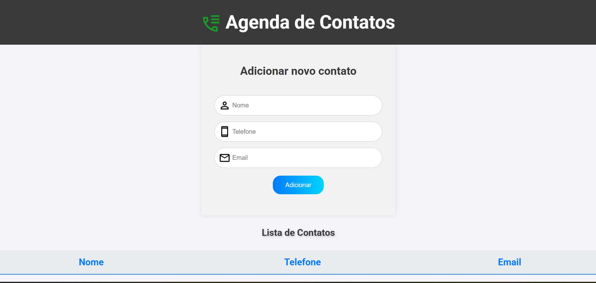

# Agenda de Contatos



Este projeto é uma agenda de contatos que permite adicionar, visualizar e gerenciar contatos, projeto proposto pela EBAC e feito por mim, utilizando o VS Code.

## Instalação

1. Clone o repositório:
   ```bash
   git clone https://github.com/JoaoCSO/agenda_telefonica
